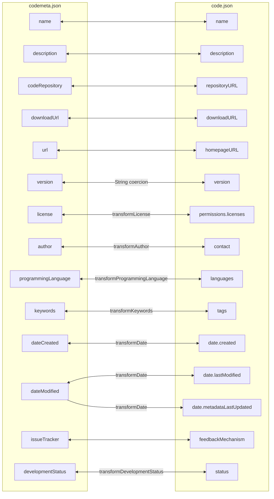

# code.json ↔ codemeta Field Mapping

This document is the field-by-field reference for how `code.json` and `codemeta.json` map to each other in this package. The engine in `../helpers/convert.ts` has no knowledge of either format — every relationship described below is encoded as a `MappingEntry` in `codemeta-mapping.ts` (codemeta → code.json) or `codejson-mapping.ts` (code.json → codemeta).

## Visual overview

The diagram below shows every mapped field. Plain double arrows indicate direct (1:1) renames; labeled arrows indicate transforms that reshape the value. Fields without arrows are either target-only defaults (filled in when there's no source equivalent) or source-only data (silently dropped during conversion).

## Direct (1:1) mappings

These fields hold the same data in both formats — only the key name differs. The conversion is lossless in both directions.

| codemeta | code.json |
|---|---|
| `name` | `name` |
| `description` | `description` |
| `codeRepository` | `repositoryURL` |
| `downloadUrl` | `downloadURL` |
| `url` | `homepageURL` |
| `issueTracker` | `feedbackMechanism` |

## Transformed mappings

These fields represent the same concept but in different shapes. Each row has both a forward and reverse transform; both must agree for round-trips to be lossless.

| codemeta | code.json | Transform | Notes |
|---|---|---|---|
| `version` | `version` | `String` coercion | Forces string output even if codemeta has a number. |
| `license` | `permissions.licenses` | `transformLicense` ⇄ `transformLicenseToCodemeta` | codemeta is a URL string or CreativeWork; code.json is `[{ name, URL }]`. SPDX identifier is extracted from the URL and validated against the code.json enum (unrecognized identifiers fall through to `"Other"`). **Lossy** in the reverse direction: only the first license entry is kept. |
| `author` | `contact` | `transformAuthor` ⇄ `transformContactToAuthor` | codemeta `author` may be a Person object or an array of Persons; code.json `contact` is a single `{ name, email }`. The forward direction builds `name` from `givenName`/`familyName` when `name` is absent. The reverse direction splits `name` on whitespace. **Lossy** in the forward direction: co-authors after the first are dropped. |
| `programmingLanguage` | `languages` | `transformProgrammingLanguage` ⇄ `transformLanguagesToCodemeta` | codemeta accepts a string, an array, or ComputerLanguage objects; code.json requires a string array. Single-element arrays unwrap to a string when going to codemeta. |
| `keywords` | `tags` | `transformKeywords` ⇄ `transformTagsToKeywords` | codemeta 3.0 accepts an array or a comma-delimited string; code.json requires an array. Both transforms output arrays. |
| `dateCreated` | `date.created` | `transformDate` ⇄ `stripMidnightUtc` | Plain dates like `2024-01-15` get `T00:00:00Z` appended for code.json. The reverse direction strips that suffix only when it's exact midnight UTC, so real datetimes are preserved. |
| `dateModified` | `date.lastModified` | `transformDate` ⇄ `stripMidnightUtc` | Same as `dateCreated`. |
| `dateModified` | `date.metadataLastUpdated` | `transformDate` (forward only) | The same `dateModified` source feeds both `lastModified` and `metadataLastUpdated`. The reverse direction has no entry for `metadataLastUpdated` since `lastModified` already covers `dateModified`. |
| `developmentStatus` | `status` | `transformDevelopmentStatus` ⇄ `transformStatusToCodemeta` | Maps repostatus.org-style values (`active`, `wip`, `inactive`, ...) to the code.json `status` enum. **Lossy:** `Alpha`, `Beta`, and `Release Candidate` all collapse to `wip` going to codemeta, and `wip` reverses to `Development`. |

## Target-only defaults

These fields are required (or strongly encouraged) in the target format but have no equivalent in the source format. The mapping fills them with placeholder values that pass schema validation, leaving the actual data for a human to fill in afterward.

### Written when codemeta is the source (output is code.json)

| code.json field | Default | Reason |
|---|---|---|
| `permissions.usageType` | `[]` | Schema requires an array; empty signals "needs review." |
| `permissions.exemptionText` | `""` | Free-form, may be null. |
| `organization` | `""` | Free-form. |
| `repositoryVisibility` | `"public"` | Enum requires `public` or `private`; OSS default is public. |
| `vcs` | `"git"` | Enum requires one of `git`, `hg`, `svn`, `rcs`, `bzr`, `none`; `git` is overwhelmingly common. |
| `laborHours` | `0` | Numeric placeholder. |
| `reuseFrequency` | `{}` | Both `forks` and `clones` are optional sub-properties. |
| `maintenance` | `"none"` | Enum value indicating no dedicated maintenance staff. |
| `contractNumber` | `[]` | Empty array. |
| `SBOM` | `"None"` | Schema description says enter `"None"` if no SBOM exists. |
| `AIUseCaseID` | `"0"` | Schema description says enter `"0"` if not in the inventory. |
| `disclaimerURL`, `disclaimerText` | `""` | Free-form. |
| `relatedCode`, `reusedCode`, `partners` | `[]` | Empty arrays. |
| `date.metadataLastUpdated` | current ISO datetime | Set at module load time. Used only when `dateModified` is absent from the source. |

### Written when code.json is the source (output is codemeta)

| codemeta field | Default | Reason |
|---|---|---|
| `@context` | `"https://w3id.org/codemeta/3.0"` | JSON-LD context required for codemeta 3.0 validation. |
| `@type` | `"SoftwareSourceCode"` | The expected type for software metadata. |

## Source-only fields (lossy — dropped)

These fields exist in one format but have no place in the other. They are silently dropped during conversion.

**codemeta fields with no code.json equivalent**: `applicationCategory`, `contributor`, `datePublished`, `funder`, `operatingSystem`, `relatedLink`, `softwareRequirements`, `referencePublication`, `continuousIntegration`, plus any namespaced JSON-LD extensions like `codemeta:contIntegration`.

**code.json fields with no codemeta equivalent**: `organization`, `repositoryVisibility`, `vcs`, `reuseFrequency`, `maintenance`, `contractNumber`, `disclaimerURL`, `disclaimerText`, `relatedCode`, `reusedCode`, `partners`, `permissions.usageType`, `permissions.exemptionText`, `date.metadataLastUpdated`.

## Round-trip summary

Round-tripping `codemeta → code.json → codemeta` (or the reverse) is mostly lossless for fields covered by the mapping. The known data losses are:

- **Co-authors.** Multiple `author` entries collapse to a single `contact`; only the first survives.
- **Multiple licenses.** Codemeta carries a single `license` URL; if code.json has multiple license entries, only the first is kept in codemeta.
- **Status granularity.** `Alpha`, `Beta`, and `Release Candidate` all collapse to `wip` going to codemeta, and `wip` reverses to `Development`.
- **Source-only fields.** Any field listed in the source-only section above is dropped.

Date round-trips are clean: a plain codemeta date like `2024-01-15` survives the trip through code.json's ISO datetime format and back.